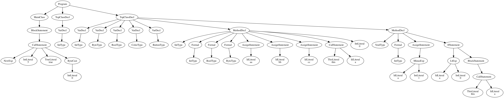
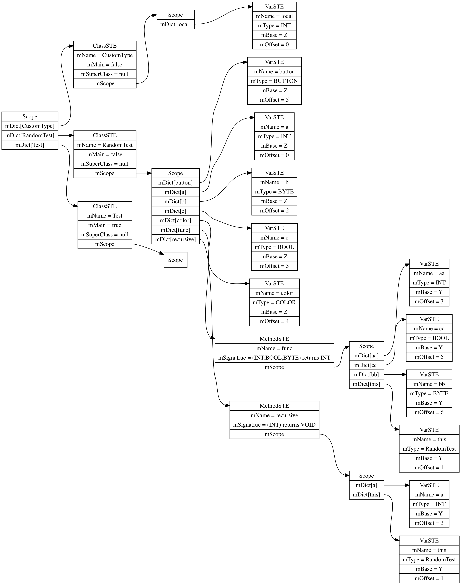

# Sp19_compiler
assignment for compiler course in spring19 in UVA

## Usage

```bash
// using only lexer
java -jar MJPA2.jar example.java
// using compiler
java -jar MJ.jar example.java
// using simulator
java -jar MJSIM.jar -b -f example.java.s
// visualize AST
dot example.ast.dot -Tpng -o example.ast.png
// visualize Symbol Table
dot example.ST.dot -Tpng -o example.ST.png
```

For example, [Test.java](./sample/Test.java) has the following AST and Symbol Table:



